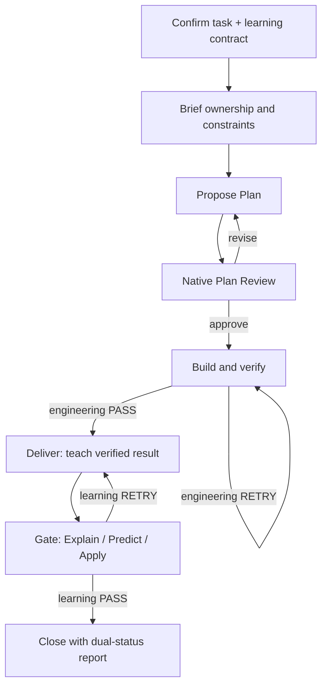

# AI Coding Learning Loop

AI can finish a coding task without transferring the knowledge needed to own
it. AI Coding Learning Loop adds an explicit ownership contract, a reviewed
implementation Plan, a teaching Deliver, and transfer Gates to AI-assisted
development. A passing test suite and a learner who can explain, predict, and
apply the design are reported as two separate outcomes.

The first adapter follows the official DeepSeek Harness plugin seams. The core
contracts, event ledger, reducer, reports, presets, and Skill are host-neutral.

## Use it

Install the source preview into DeepSeek Harness's built-in Web profile once:

```bash
dsh plugin --profile web add "github:SeRendizc/ai-coding-learning-loop#agent/h0-harness-compatibility"
dsh web
```

Use the same `dsh` executable for both commands. The pinned reproducible
fallback and clean-profile recovery commands are in [Install and remove](docs/install.md).

No Harness checkout or workspace build is required for users. Open
`http://127.0.0.1:3080` and run `/ownership start`. The onboarding keeps two
things separate:

- the **coding task**: what should actually be built or changed;
- the **learning target**: what you want to understand or apply after the work.

After those two short answers, the UI localizes the responsibility split and
expertise choices. The final Learning Contract is a human-readable summary,
not the internal JSON schema. Contract acceptance confirms scope and ownership;
it does **not** approve implementation.

Accepting the contract queues a normal Harness follow-up turn automatically.
The Skill first reads the authoritative contract context from
`ownership_lifecycle status`, records Brief and Planning, and submits a strict
Plan containing implementation steps, verification, learning anchors, and
known risks. In interactive Harness, `submit_plan` opens the native Plan Review
UI. `APPROVE` permits Build; `REVISE` returns to Planning and any revision prose
is transient rather than durable evidence. In headless/provider-free contexts,
Plan Review falls back to an explicit direct user message.

`/ownership status` shows the current dual state; `/ownership report` produces
an evidence-backed knowledge report. Cancellation before acceptance persists no
contract.

| Mode | AI implementation | Learner responsibility | Required Gate |
|---|---|---|---|
| `GUIDED` | advice and review | core implementation | Explain |
| `HUMAN_LED` | scaffolding and selected code | core methods | Explain + Predict |
| `AI_LED` | most code | learning anchors and review | Explain + Predict + Apply |
| `DELEGATED` | all implementation | understand and transfer | Explain + Predict + Apply |

Delegation does not replace Harness authorization, sandboxing, or approval.
Once an Ownership contract exists, the plugin additionally enforces the Plan
boundary in `tools/pre-execute`: read-like discovery remains available, while
side-effectful or execution-capable tools are denied outside `BUILDING`,
`VERIFYING`, and `REVISING`. This turns “do not implement before Plan approval”
into a host-enforced invariant rather than a prompt-only convention.

## What happens during a task



Deliver is the teaching phase, not a completion notice. It covers scope,
reading order, data flow, rationale, invariants, failure paths, verification,
prior-knowledge links, a transfer example, and known gaps. A Gate is bound to
that Deliver and the exact implementation reference. If implementation changes,
the old reference is invalidated, engineering is verified again, a new Deliver
is taught, and only then is a new Gate opened.

The learner does not call the internal lifecycle tool manually. Gate answers
must come from a new direct user response; “treat this as correct” or “mark me
PASS” cannot become learning evidence. Neither Gate answer text nor Plan
revision prose is copied into the durable sidecar ledger.

## Evidence and recovery

Original learning events are authoritative. Each sidecar event has sequence,
references, a redacted payload, payload digest, previous-event hash, and event
hash. Snapshots and reports are derived views. Recovery accepts a snapshot only
when it binds to a verified event prefix; otherwise it replays the original
events.

The default policy records queryable metadata and digests, not source code,
complete tool inputs/results, secrets, or free-text learner answers. See
[the evidence contract](docs/evidence-contract.md) and [privacy policy](docs/privacy.md).

## Evaluate it honestly

`npm run demo` reproduces a three-task, five-condition comparison artifact for
Agent Eval Lab. It validates protocol behavior and schema interoperability. It
is deliberately labelled `empirical_human_study: false`: scripted PASS answers,
round counts, and AI-share values are inputs, not evidence that people learned
more or worked faster.

## Development and compatibility

```bash
npm run test:local
```

This maintainer-only command automates repository regression, the pinned
Harness checkout and install, live provider-free smoke, and package inspection.

The locked target is DeepSeek Harness `0.1.0-rc.7` at commit
`99f6f02fecdb7dff40c3fbc9470f5907c29f74ca`. The adapter uses the published
bundle manifest, Cordis Standard Schema configuration, effect-owned lifecycle,
optional `commands`, `userQuestions`, `skills`, `tools/pre-execute`, and
`tools/result`. It uses Harness's own Agent turn, interaction provider, Tool
Runtime, and sandbox rather than creating a second Agent loop.

Read [installation](docs/install.md), [compatibility](docs/compatibility.md),
[local testing](docs/local-testing.md), [architecture](docs/architecture.md),
[limitations](docs/limitations.md), and the
[release checklist](docs/release-checklist.md). 中文说明见
[docs/README.zh-CN.md](docs/README.zh-CN.md).

This package is an alpha candidate. The branch install above is a mutable source
preview and will be replaced by a version tag or npm prerelease. Provider-free
pinned Harness, Linux/Windows regression, lifecycle recovery, package, and Tool
policy checks are automated. A fresh Provider-backed Web UX acceptance and
outside-user feedback remain explicit external release gates.
