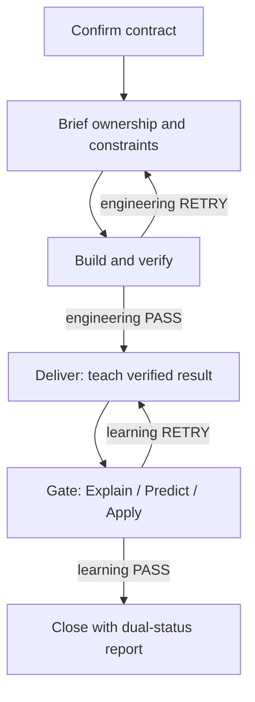

# AI Coding Learning Loop

AI can finish a coding task without transferring the knowledge needed to own
it. AI Coding Learning Loop adds an explicit ownership contract, a teaching
Deliver, and transfer Gates to AI-assisted development. A passing test suite
and a learner who can explain, predict, and apply the design are reported as
two separate outcomes.

The first adapter follows the official DeepSeek Harness plugin seams. The core
contracts, event ledger, reducer, reports, presets, and Skill are host-neutral.

## Use it

Install the source preview into DeepSeek Harness's built-in Web profile once:

```bash
dsh plugin --profile web add "github:SeRendizc/ai-coding-learning-loop#agent/h0-harness-compatibility"
dsh web
```

Use the same `dsh` executable for both commands. The pinned reproducible
fallback and clean-profile recovery commands are in [Install and remove](docs/install.md).

No Harness checkout or workspace build is required for users. Open
`http://127.0.0.1:3080`, run `/ownership start`, select a mode and one concrete learning target, then
review the complete Learning Contract before accepting it. `/ownership status`
shows the current dual state; `/ownership report` produces an evidence-backed
knowledge report. Cancellation before acceptance persists no contract.

After acceptance, the packaged Skill drives the teaching protocol and the
session-scoped `ownership_lifecycle` tool records each validated transition.
The learner does not call that internal tool manually. The runtime requires a
current direct user message before recording a Gate response, but neither the
answer text nor a content digest is copied into the sidecar evidence. Only the
response occurrence, rubric result, gaps, and learning state are durable.

| Mode | AI implementation | Learner responsibility | Required Gate |
|---|---|---|---|
| `GUIDED` | advice and review | core implementation | Explain |
| `HUMAN_LED` | scaffolding and selected code | core methods | Explain + Predict |
| `AI_LED` | most code | learning anchors and review | Explain + Predict + Apply |
| `DELEGATED` | all implementation | understand and transfer | Explain + Predict + Apply |

Delegation does not grant tool permission. Harness remains responsible for
authorization, approval, sandboxing, execution, and its own Agent loop.

## What happens during a task



Deliver is the teaching phase, not a completion notice. It covers scope,
reading order, data flow, rationale, invariants, failure paths, verification,
prior-knowledge links, a transfer example, and known gaps. A Gate is bound to
that Deliver and the exact implementation reference. If implementation changes,
the old reference is invalidated, engineering is verified again, a new Deliver
is taught, and only then is a new Gate opened.

## Evidence and recovery

Original learning events are authoritative. Each sidecar event has sequence,
references, a redacted payload, payload digest, previous-event hash, and event
hash. Snapshots and reports are derived views. Recovery accepts a snapshot only
when it binds to a verified event prefix; otherwise it replays the original
events.

The default policy records queryable metadata and digests, not source code,
complete tool inputs/results, secrets, or free-text learner answers. See
[the evidence contract](docs/evidence-contract.md) and [privacy policy](docs/privacy.md).

## Evaluate it honestly

`npm run demo` reproduces a three-task, five-condition comparison artifact for
Agent Eval Lab. It validates protocol behavior and schema interoperability. It
is deliberately labelled `empirical_human_study: false`: scripted PASS answers,
round counts, and AI-share values are inputs, not evidence that people learned
more or worked faster.

## Development and compatibility

```bash
npm run test:local
```

This maintainer-only command automates repository regression, the pinned
Harness checkout and install, live provider-free smoke, and package inspection.

The locked target is DeepSeek Harness `0.1.0-rc.5` at commit
`47f943859bef60e4160492346772ded9b24f765a`. The adapter uses the published
bundle manifest, Cordis Standard Schema configuration, effect-owned lifecycle,
optional `commands` and `userQuestions`, `tools/pre-execute`, and
`tools/result`. It also registers the packaged Skill through the optional
`ctx.skills` seam. Tool hooks are observation-only and never create a second
Agent loop.

Read [installation](docs/install.md), [compatibility](docs/compatibility.md),
[local testing](docs/local-testing.md), [architecture](docs/architecture.md),
[limitations](docs/limitations.md), and the
[release checklist](docs/release-checklist.md). 中文说明见
[docs/README.zh-CN.md](docs/README.zh-CN.md).

This package is an alpha candidate. The branch install above is a mutable source
preview and will be replaced by a version tag or npm prerelease. A pinned live
Harness Provider-backed interactive run, outside-user feedback, and a community
release post remain explicit external release gates. Provider-free Harness
service, lifecycle-tool, recovery, and package smokes are automated.
