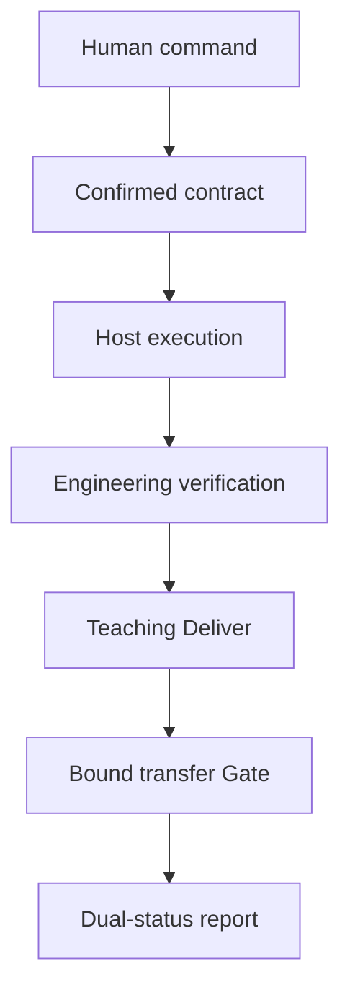

# Architecture

AI Coding Learning Loop has four replaceable layers:

1. **Contracts** define delegation, Deliver, Gate, events, and reports without a host dependency.
2. **Core** validates contracts and deterministically reduces accepted events into dual status.
3. **Evidence** stores privacy-safe original learning events in a hash-chained sidecar and treats snapshots as disposable caches.
4. **Host adapters** map commands, questions, tool observations, and projections to a specific harness.

The DeepSeek Harness adapter is deliberately thin. Harness still owns the Agent loop, tool registry, approval, sandbox, sessions, and UI. The plugin never turns a learning mode into tool authorization.

## Control flow

Original events are authoritative for the learning domain. Reports and snapshots are derived. The sidecar identifies itself in every report and is not presented as native Harness session state.
